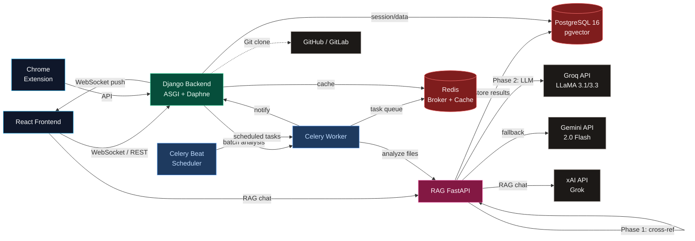

<div align="center">

# GhostCode

### AI-Powered Dead Code Detector for Modern Codebases

[](https://python.org)
[](https://www.djangoproject.com/)
[](https://react.dev/)
[](https://fastapi.tiangolo.com/)
[](https://www.postgresql.org/)
[](https://docs.celeryq.dev/)
[](https://redis.io/)
[](https://tailwindcss.com/)

**Detect unused imports, dead functions, unreachable branches, and redundant code across your entire codebase in seconds.**

[🐛 Report Bug](https://github.com/anomalyco/opencode/issues) · [✨ Feature Request](https://github.com/anomalyco/opencode/issues)

---

</div>

## Features

- **🔍 Two-Phase Analysis** — Phase 1: lightning-fast in-memory cross-referencing across all files (no LLM). Phase 2: LLM-powered analysis for files that escape static detection, catching intra-file dead code.
- **🌐 Multi-Language Support** — Python, JavaScript, TypeScript, JSX, TSX, CSS, HTML, JSON, Vue, Svelte, and 60+ other file types via smart token extraction.
- **🤖 LLM-Enhanced Detection** — Uses Groq (Llama) as primary LLM provider with Gemini fallback, and xAI (Grok) for semantic RAG chat over analyzed code.
- **🧠 Vector RAG Engine** — Embedding-based semantic search over analyzed code chunks using FastEmbed (local) or OpenAI embeddings with pgvector storage.
- **📁 Flexible Input Methods** — Upload single files, batch folders (via WebSocket progress), paste code, or clone entire GitHub/GitLab repositories.
- **🔐 Multi-Factor Authentication** — TOTP-based MFA (Google Authenticator compatible) with two-step login and role-based session enforcement.
- **👥 Role-Based Workflow** — Senior (reviewer/manager) and Junior (submitter) roles with code review feedback, inline commenting, and resolution tracking.
- **💬 Real-Time Collaboration** — WebSocket-powered live analysis progress, team chat rooms, and per-issue discussion threads with AI-hint prefills.
- **📊 Scheduled Analysis** — Global or per-folder scheduled scans with Celery Beat, automatic execution, and email notifications.
- **📧 Email Notifications** — Welcome emails, login alerts, password resets, and batch-complete notifications via Gmail SMTP.
- **📱 Fully Responsive** — Dark-themed, mobile-first UI with role-based tabbed navigation, Monaco code viewer, and real-time dashboards.
- **🔌 Chrome Extension** — Companion browser extension for detecting dead code in browser-dev JavaScript/TypeScript files.

## Tech Stack

| Layer | Technology |
|-------|-----------|
| **Frontend** | React 19, Vite 8, TypeScript 6, Tailwind CSS 4, Zustand 5, Motion 12 |
| **Backend** | Django 6.0, DRF 3.17, Channels 4.3, Daphne 4.2, Celery 5.6 |
| **RAG Service** | FastAPI 0.136, SQLAlchemy 2.0 (async), pgvector |
| **Database** | PostgreSQL 16 (pgvector), Redis 7 |
| **LLM Providers** | Groq (Llama 3.1/3.3), Gemini 2.0 Flash, xAI (Grok) |
| **Code Analysis** | Python AST, custom cross-reference engine, FastEmbed |
| **DevOps** | Docker Compose, Nginx, GitHub Actions |

## Quick Start

### Prerequisites

- [Docker Desktop](https://www.docker.com/products/docker-desktop/) (must be running)
- [Node.js](https://nodejs.org/) 22+

### With Docker

```powershell
docker compose -f docker-compose.dev.yml up -d
docker compose -f docker-compose.dev.yml exec backend python manage.py migrate
cd Frontend
npm install
npm run dev
```

### Without Docker

**Backend:**

```bash
cd Backend
pip install -r requirements/dev.txt
python manage.py migrate
python manage.py runserver
```

**RAG Service:**

```bash
cd services/rag
pip install -r requirements.txt
uvicorn app.main:app --reload
```

**Frontend:**

```bash
cd Frontend
npm install
npm run dev
```

## How It Works

### Two-Phase Dead Code Detection

```
                        ┌─────────────────────────────────────┐
                        │         Your Codebase               │
                        │  (.py, .js, .ts, .jsx, .tsx, ...)  │
                        └──────────┬──────────────────────────┘
                                   │
                                   ▼
┌──────────────────────────────────────────────────────────────────┐
│  Phase 1: Fast Cross-Reference (In-Memory, No LLM)              │
│                                                                  │
│  Extract Symbols ──▶ Build Token Index ──▶ Cross-File Check     │
│  (functions,        (word → set of      (does symbol appear     │
│   classes, imports,  file indices)       in any other file?)    │
│   variables)                                                     │
│                                                                  │
│  Result: Files with detected cross-refs → flagged directly      │
│          Files with ZERO hits → passed to Phase 2               │
└──────────────────────────────────────────────────────────────────┘
                                   │
                                   ▼
┌──────────────────────────────────────────────────────────────────┐
│  Phase 2: LLM Analysis (Groq / Gemini)                          │
│                                                                  │
│  For files where ALL symbols appear unreferenced:               │
│  • Send full file content to LLM with specialized prompt        │
│  • LLM identifies: unreachable code, dead branches,             │
│    redundant logic, unused parameters, dead exports             │
│  • Results merged & deduped with Phase 1 findings               │
└──────────────────────────────────────────────────────────────────┘
                                   │
                                   ▼
┌──────────────────────────────────────────────────────────────────┐
│  Output                                                          │
│  • Dead code candidates with severity levels                    │
│  • Health score per file & codebase                             │
│  • Inline code viewer with issue highlighting                   │
│  • AI-powered chat for deep-dive questions                      │
└──────────────────────────────────────────────────────────────────┘
```

### Data Flow

```
1. Upload ──▶ 2. Batch Analysis ──▶ 3. Store ──▶ 4. Review
     │              │                     │            │
  files /        Celery task          PostgreSQL    WebSocket
  folder /       → RAG service         + Redis      real-time
  Git repo       two-phase analysis                 progress
```

## Architecture



## Project Structure

```
DeadCode_Detector/
├── Backend/                        # Django monolith
│   ├── core/                       # Django project config
│   │   ├── settings/               # base.py · dev.py · prod.py
│   │   ├── celery.py               # Celery app + beat schedule
│   │   ├── asgi.py · wsgi.py       # ASGI/WSGI entrypoints
│   │   └── websocket_auth.py       # JWT WebSocket middleware
│   ├── accounts/                   # Main Django app
│   │   ├── models.py               # CustomUser, UserSession, JuniorSubmission
│   │   ├── views.py                # Auth, submission, analysis REST endpoints
│   │   ├── serializers.py          # DRF serializers
│   │   ├── tasks.py                # Celery tasks (batch_analyze, etc.)
│   │   ├── consumers.py            # WebSocket consumers
│   │   ├── routing.py              # WebSocket URL patterns
│   │   ├── chat_models.py          # ChatRoom, IssueThread, RoomMessage
│   │   ├── chat_views.py           # Chat REST endpoints
│   │   ├── git_views.py            # Git clone & file fetch
│   │   ├── rag_proxy.py            # Proxy to RAG service
│   │   ├── permission.py           # Custom DRF permissions
│   │   ├── email_utils.py          # Async email sending
│   │   ├── scheduler.py            # Celery Beat scheduled analysis
│   │   ├── management/commands/    # Custom management commands
│   │   └── migrations/             # Database migrations
│   ├── requirements/               # base.txt · dev.txt · prod.txt
│   ├── Dockerfile
│   └── manage.py
│
├── services/rag/                   # RAG FastAPI service
│   └── app/
│       ├── main.py                 # FastAPI entry point
│       ├── auth.py                 # JWT auth dependency
│       ├── db.py                   # Async SQLAlchemy + pgvector
│       ├── routers/                # analysis.py · chat.py
│       └── services/               # analyzer · cross_reference · chunker
│           ├── analyzer.py         # Two-phase analysis pipeline
│           ├── cross_reference.py  # Symbol extraction & cross-ref (628 lines)
│           ├── chunker.py          # Code chunking
│           ├── embedder.py         # Embedding generation
│           ├── grok_client.py      # LLM client with key rotation
│           ├── rag.py              # RAG retrieval & Q&A
│           └── prompts.py          # LLM prompt templates
│
├── Frontend/                       # React 19 + Vite 8
│   └── src/
│       ├── api/                    # client.ts · auth.ts · analysis.ts · ws.ts
│       ├── store/                  # authStore.ts · analysisStore.ts (Zustand)
│       ├── hooks/                  # useAnalysisSocket · useChatSocket
│       ├── lib/                    # fileTree.ts · logger.ts
│       └── components/
│           ├── tabs/               # 12 tab components
│           │   ├── OverviewTab     # Dashboard with charts & trends
│           │   ├── AnalyzerTab     # Code workspace & analysis
│           │   ├── HistoryTab      # Past analysis history
│           │   ├── JuniorTab       # Junior submission workflow
│           │   ├── TeamChatTab     # Team chat rooms
│           │   ├── AIInspectorTab  # Deep-dive analysis
│           │   └── ...             # Settings, Admin, Chat, etc.
│           ├── LandingPage.tsx
│           ├── AuthScreen.tsx
│           ├── DashboardShell.tsx  # Tab navigation shell
│           └── CodeViewer.tsx
│
├── extension/                      # Chrome extension (MV3)
│   ├── manifest.json
│   ├── background.js
│   ├── popup.html
│   └── popup.js
│
├── nginx/                          # Production reverse proxy
│   ├── Dockerfile
│   └── nginx.conf
│
├── .github/workflows/ci.yml        # GitHub Actions CI
├── docker-compose.dev.yml          # Development services
├── docker-compose.prod.yml         # Production services
├── .env.docker                     # Docker environment variables
├── AGENTS.md                       # Developer setup guide
└── pyproject.toml                  # Python project config
```

## Services

| Service | Role |
|---------|------|
| Django Backend (ASGI) | REST + WebSocket API |
| RAG FastAPI | Analysis pipeline & chat endpoints |
| PostgreSQL 16 (pgvector) | Primary database |
| Redis 7 | Celery broker / cache / results |
| Vite Dev Server | Frontend dev server |
| Nginx | Production reverse proxy |

## API Endpoints

### Authentication
| Method | Endpoint | Description |
|--------|----------|-------------|
| POST | `/api/auth/register/` | User registration |
| POST | `/api/auth/token/` | Stage 1 login (pre-auth JWT) |
| POST | `/api/auth/token/refresh/` | Refresh JWT |
| POST | `/api/auth/mfa/verify-login/` | Stage 2 MFA verification |
| POST | `/api/auth/mfa/setup/` | Generate MFA QR code |
| POST | `/api/auth/mfa/activate/` | Activate MFA |
| POST | `/api/auth/password-reset/` | Request password reset |
| POST | `/api/auth/password-reset/confirm/` | Confirm password reset |
| POST | `/api/auth/logout/` | Logout |

### Submissions & Analysis
| Method | Endpoint | Description |
|--------|----------|-------------|
| POST | `/api/auth/junior/upload/` | Upload single file |
| POST | `/api/auth/junior/batch-upload/` | Upload multiple files |
| POST | `/api/auth/junior/analyze/:id/` | Trigger/cancel analysis |
| POST | `/api/analysis/batch/` | Submit batch analysis |
| GET | `/api/analysis/batch/:batch_id/results/` | Poll batch results |
| POST | `/api/auth/junior/git-import/` | Import files from Git repo |

### WebSockets
| Path | Purpose |
|------|---------|
| `ws://host/ws/analysis/{batch_id}/` | Real-time batch analysis progress |
| `ws://host/ws/notifications/` | User notifications |
| `ws://host/ws/chat/{room_name}/` | Team chat rooms |

For the full API reference with request/response examples and error codes, see [API_DOCS.md](API_DOCS.md).

## Environment Variables

<details>
<summary><strong>.env.docker</strong> (shared by all Docker services)</summary>

| Variable | Description |
|----------|-------------|
| `SECRET_KEY` | Django secret key |
| `DB_NAME`, `DB_USER`, `DB_PASSWORD` | PostgreSQL credentials |
| `DB_HOST`, `DB_PORT` | PostgreSQL host and port |
| `REDIS_URL` | Redis connection URL |
| `CELERY_BROKER_URL` | Celery broker (Redis) |
| `CELERY_RESULT_BACKEND` | Celery results (Redis) |
| `GROQ_API_KEYS` | Comma-separated Groq API keys (key rotation) |
| `GEMINI_API_KEY` | Gemini API key (fallback LLM) |
| `RAG_DATABASE_URL` | Async PostgreSQL URL for RAG service |
| `RAG_ANALYZE_URL` | RAG analysis endpoint URL |
| `EMAIL_HOST`, `EMAIL_PORT` | SMTP server settings |
| `EMAIL_HOST_USER`, `EMAIL_HOST_PASSWORD` | SMTP credentials |
| `FRONTEND_URL` | Frontend origin for CORS |
| `CORS_ALLOWED_ORIGINS` | Allowed CORS origins |
| `ALLOWED_HOSTS` | Django allowed hosts |
| `DJANGO_DEBUG` | Debug mode toggle |
</details>

<details>
<summary><strong>Frontend (.env.development / .env.example)</strong></summary>

| Variable | Description |
|----------|-------------|
| `VITE_WS_URL` | WebSocket server URL |
| `VITE_API_URL` | Backend API URL |
| `VITE_RAG_URL` | RAG service URL |
</details>

## CI/CD

GitHub Actions runs on every push/PR to `main`:
- **lint-backend** — Ruff checks & formatting
- **test-backend** — Django tests with PostgreSQL service container
- **lint-frontend** — ESLint
- **typecheck-frontend** — TypeScript build check
- **build-docker** — Production Docker image build

## Chrome Extension

The `extension/` directory contains a Manifest V3 browser extension that integrates with GhostCode to detect dead code in browser-dev JavaScript/TypeScript files. Load it as an unpacked extension in Chrome's developer mode.

## Contributing

We welcome contributions! Here's how you can help:

- 🐛 **Report bugs** — Open a [GitHub Issue](https://github.com/anomalyco/opencode/issues)
- 💡 **Suggest features** — Feature requests are always welcome
- 🔧 **Submit pull requests** — Fork the repo, make your changes, and open a PR
- ⭐ **Star the repo** — Show your support

## License

This project is licensed under the MIT License. See [LICENSE](LICENSE) for details.

---

<div align="center">

### ⭐ If you find this project useful, give it a star! ⭐

Built with ❤️ for developers who hate dead code

</div>
